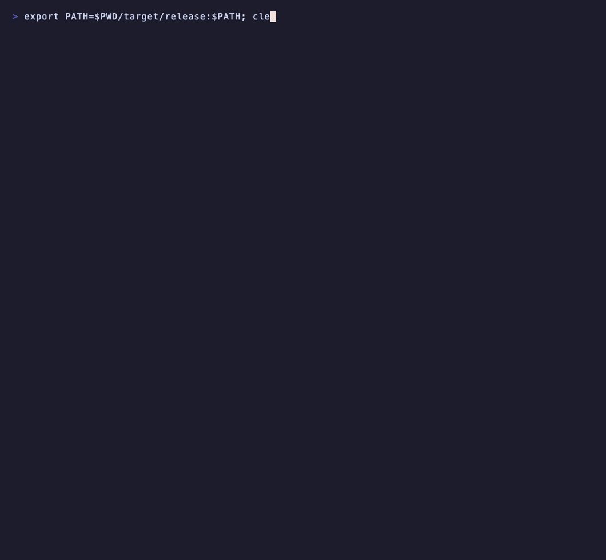

<h1 align="center">🚪 whoknocked</h1>

<p align="center"><strong>Who knocked on your SSH door?</strong></p>

<p align="center">
A tiny, fast, local analyzer for Linux auth logs. Point it at
<code>/var/log/auth.log</code> and it tells you who tried to get in,
who succeeded, and which of those you should actually worry about.
</p>

<p align="center">
  <a href="https://github.com/tdiprima/whoknocked/actions/workflows/ci.yml"></a>
  <a href="https://github.com/tdiprima/whoknocked/releases/latest"></a>
  <a href="https://crates.io/crates/whoknocked"></a>
  <a href="LICENSE"></a>
</p>

<p align="center">
  
</p>

Your auth log is thousands of lines of noise with a handful of lines that
matter. `whoknocked` turns the raw text into structured events, runs a small
set of detection rules, and shows you only the **interesting** activity:

- 🔴 **Brute force**: one IP hammering logins
- 🔴 **Login after repeated failures**: a wall of failures, then a success. The one you really want to know about.
- 🟡 **Username / password spray**: one IP, many accounts, a couple of tries each

Single static binary. No daemon, no database, no agent, no cloud. Runs in
milliseconds on a log with hundreds of thousands of lines.

## Try it in 10 seconds

```bash
curl -fsSL https://raw.githubusercontent.com/tdiprima/whoknocked/main/install.sh | sh
sudo whoknocked
```

Or with Cargo:

```bash
cargo install whoknocked
```

No root handy? Run it against the bundled attack story:

```bash
git clone https://github.com/tdiprima/whoknocked.git && cd whoknocked
cargo run --release -- --file examples/sample-auth.log
```

```text
🚪 WHOKNOCKED
Authentication activity — examples/sample-auth.log

Risk: ELEVATED ⚠️

       39   total events
        4   successful logins
        8   failed logins
       14   invalid users
        6   sudo events
        4   unique source IPs
       16   unique usernames

Interesting activity
────────────────────────────────────────────────────

🔴 09:14:02 Possible brute force
   Source:       45.20.13.8
   Failures:     12 (peak 12 within 5 min)
   First seen:   09:14:02
   Last seen:    09:18:00
   Users tried:  root (4), admin (3), backup (1), deploy (1), oracle (1), postgres (1), +1 more

🔴 09:18:47 Login after repeated failures
   User:      backup
   Source:    45.20.13.8
   12 failed attempts, then success after 47s
   Time:      09:18:47

   Recommendation:
   Investigate whether this source and login were expected.

🟡 10:02:01 Possible username/password spray
   Source IP:         45.20.10.2
   Accounts tried:    9
   Attempts/account:  1-1
   Duration:          109s
```

Open `examples/sample-auth.log` and you can read the whole story: the attacker
guesses `backup`'s password, logs in, reads `/etc/shadow`, adds a sudo user,
and pulls down a script. `whoknocked` flags the login that made it possible.

## Why not just grep?

You can, and everyone does, right up until the morning after. `grep "Failed
password"` gives you a count. `whoknocked` gives you **correlation**: the
success that followed the failures, the IP that touched nine accounts in two
minutes, and the usernames an attacker thinks you have. It is the view a SIEM
would give you, without the SIEM.

## Automatic log-file detection (Ubuntu vs. RHEL)

Different distributions write SSH/sudo activity to different files. whoknocked
reads `/etc/os-release` and picks the right one for you:

| Distribution family                         | Auth log            |
| ------------------------------------------- | ------------------- |
| Ubuntu, Debian (and derivatives)            | `/var/log/auth.log` |
| RHEL, Rocky, AlmaLinux, CentOS, Fedora, Oracle Linux | `/var/log/secure`   |

Detection uses both the `ID` and `ID_LIKE` fields in `/etc/os-release`, so
derivatives resolve to the correct family automatically. You can always
override the choice with `--file` (see below).

## Requirements

- Nothing, if you use a prebuilt binary. Building from source needs **Rust**
  1.85 or newer (install via [rustup](https://rustup.rs/)).
- A Linux host running **Ubuntu/Debian** or **RHEL/Rocky/AlmaLinux/CentOS/Fedora**.
- Permission to read the auth log. These files are usually restricted, so you
  will typically run whoknocked with `sudo`, or as a user in the `adm` group
  (Debian/Ubuntu) or with the appropriate group on RHEL.

## Install from source

Clone and build a release binary:

```bash
git clone https://github.com/tdiprima/whoknocked.git
cd whoknocked
cargo build --release
```

The binary lands at `target/release/whoknocked`. Copy it somewhere on your
`PATH` if you like:

```bash
sudo install -m 0755 target/release/whoknocked /usr/local/bin/whoknocked
```

Or install straight from the source tree with Cargo:

```bash
cargo install --path .
```

## Usage

### Analyze the auto-detected log

```bash
sudo whoknocked
# OR
RUST_LOG=info /home/<you>/.cargo/bin/whoknocked
```

whoknocked detects your distribution, reads the correct auth log, and prints the
summary plus any findings.

### Analyze a specific file

Handy for testing, for reading a copied/rotated log, or when auto-detection
can't help:

```bash
whoknocked --file /var/log/auth.log
whoknocked --file ./examples/sample-auth.log      # try it without sudo
```

### Filters

Filters narrow the events *before* the summary and detectors run.

```bash
whoknocked --failed                 # only failed / invalid-user events
whoknocked --user alex              # only events for user "alex"
whoknocked --ip 45.20.13.8          # only events from one source IP
whoknocked --since 2h               # only the last 2 hours (s / m / h / d)
whoknocked --summary-only           # counts only, skip the detection engine
```

Filters combine, so this shows failed logins for `root` in the last day:

```bash
whoknocked --failed --user root --since 1d
```

### All options

```text
Usage: whoknocked [OPTIONS]

Options:
  -f, --file <PATH>              Log file to analyze (overrides auto-detection)
      --failed                   Show only failed / invalid-user events
      --user <NAME>              Show only events for this username
      --ip <IP>                  Show only events from this source IP
      --since <DURATION>         Only events newer than this, e.g. 90m, 2h, 3d
      --summary-only             Print the summary only; skip detection
      --brute-threshold <N>      Brute-force threshold (default 10)
      --window-minutes <MINUTES> Detection window in minutes (default 5)
      --spray-threshold <N>      Spray threshold: distinct users (default 8)
      --color <WHEN>             ANSI color: auto, always, never (default auto)
  -h, --help                     Print help
  -V, --version                  Print version
```

Color follows `--color` and the [`NO_COLOR`](https://no-color.org) convention;
piped output is plain text so it is safe to redirect or diff.

## What it detects

Each detector receives the same list of events and independently answers
"anything interesting here?"

1. **Brute force** — at least *N* failed logins from one source IP inside the
   detection window (default: 10 failures / 5 minutes). Reports the IP, total
   and peak failure counts, time span, and which usernames were targeted.

2. **Login after repeated failures** — a *successful* login from an IP that just
   produced a burst of failures (default: 5+ within the window). A normal login
   is dull; this correlation is not, so it is flagged **High**.

3. **Username / password spray** — one source IP touching many distinct
   accounts with only a couple of tries each (default: 8+ users, ≤3 per user).
   This "low and slow" pattern is different from hammering a single account.

Findings are sorted most-severe first and rendered with a risk indicator:
🔴 High, 🟡 Medium, 🟢 Normal.

## Configuration

Every threshold has a sane default and can be set two ways. Precedence, lowest
to highest: **built-in default → environment variable → command-line flag.**

| Setting                  | CLI flag             | Environment variable          | Default |
| ------------------------ | -------------------- | ----------------------------- | ------- |
| Brute-force min failures | `--brute-threshold`  | `WHOKNOCKED_BRUTE_MIN_FAILURES` | `10`    |
| Detection window (min)   | `--window-minutes`   | `WHOKNOCKED_WINDOW_MINUTES`     | `5`     |
| Spray min distinct users | `--spray-threshold`  | `WHOKNOCKED_SPRAY_MIN_USERS`    | `8`     |
| Default log file         | `--file`             | `WHOKNOCKED_FILE`               | auto    |

Example — make the brute-force rule more sensitive for one run:

```bash
WHOKNOCKED_BRUTE_MIN_FAILURES=5 whoknocked
# or
whoknocked --brute-threshold 5 --window-minutes 10
```

### Logging

Diagnostic logging is controlled by `RUST_LOG` and goes to **stderr**, keeping
the report itself clean on stdout. Normal runs are quiet (warnings only).

```bash
RUST_LOG=info whoknocked --file ./examples/sample-auth.log
```

## A note on timestamps

Traditional syslog lines (`Aug 16 09:17:21 ...`) do not include a year.
whoknocked assumes the current year and automatically rolls a timestamp back a
year if it would otherwise land in the future — so logs written in December and
read in January are dated correctly.

## Releases

Tagged pushes (`v0.4.0`) build static binaries for Linux x86_64 and aarch64
(musl) and macOS (Intel and Apple Silicon) and attach them to a GitHub Release.
`install.sh` downloads from there and verifies the SHA-256 checksum.

## Development

Run the full test suite (unit tests for the parser, detectors, config, and
filters, plus end-to-end tests that run the binary against
`examples/sample-auth.log`):

```bash
cargo test
```

Try it end to end without root using the bundled sample:

```bash
cargo run -- --file ./examples/sample-auth.log
```

### Project layout

```text
src/
├── main.rs          Orchestration only: wire the pieces together
├── cli.rs           Argument definitions and --since validation
├── config.rs        Detector thresholds (defaults → env → flags)
├── os_detect.rs     Distribution detection → auth log path
├── loader.rs        File I/O, year correction, and view filters
├── parser.rs        Raw syslog line → structured AuthEvent
├── event.rs         AuthEvent and EventType definitions
├── summary.rs       Aggregate counts
├── finding.rs       Finding and Severity types
├── report.rs        Human-readable report rendering
└── detections/
    ├── mod.rs                    Detection trait + registry
    ├── brute_force.rs            Detection #1
    ├── login_after_failures.rs   Detection #2 (correlation)
    └── password_spray.rs         Detection #3
```

The parsing and detection logic is pure (no I/O), so it is fully unit-testable
without elevated privileges. All filesystem access is isolated in `loader.rs`
and `os_detect.rs`.

### Adding a new detector

1. Create `src/detections/your_rule.rs` implementing the `Detection` trait.
2. Register it in `all_detectors()` in `src/detections/mod.rs`.

That's the only wiring required.

### Regenerating the demo GIF

```bash
brew install vhs          # or see https://github.com/charmbracelet/vhs
cargo build --release
vhs docs/demo.tape
```

## License

[MIT](LICENSE) © 2026 Tammy DiPrima

<br>
